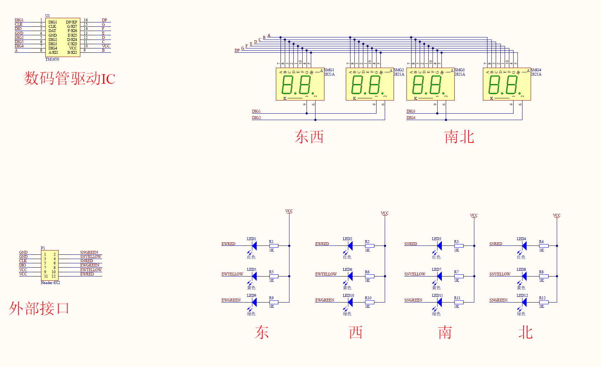
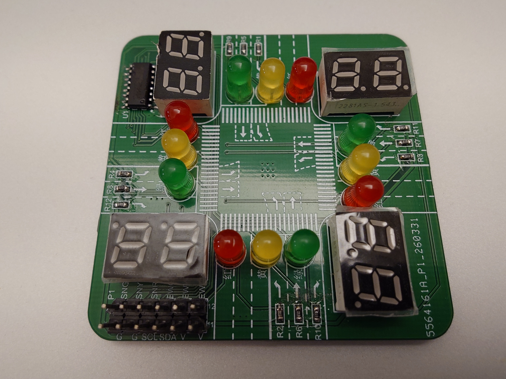

## Brief
This project is from a Embedding Engineering Training program hosted by Mr. Guo Tianxiang. Using STC89C52RC chip and multiple sensors coming with the board (which is also designed by Mr. Guo with his team).

This part of project is designed by TA, WeiHao Kong.

This project is to implement a simplified traffic light control system using the STC89C52RC microcontroller, on the dedicated extension board.

The board consists of 4 digital tubes, and 4 groups of LEDs (red, green and yellow) to simulate the traffic lights. A TM1650 digital tube driver is used to control the digital tubes, and the LEDs are controlled through the GPIOs on the microcontroller.

#### TM1650
The TM1650 digital tube driver is communicated with the microcontroller through a simple 2-wire interface (clock and data), not a standard I2C, but similar, no hardware address. Also the I2C protocol is implemented in software.

### Tasks
1. Implement a traffic light control system that cycles through the following states, for EW and NS directions:
   - State 1: Red light on for 30 seconds, green and yellow lights off, start blinking 10 seconds before switching to the next state.
   - State 2: Green light on for 27 seconds, red and yellow lights off, start blinking 10 seconds before switching to the next state.
   - State 3: Yellow light on for 4 seconds, red and green lights off, always blinking.

2. Display the remaining time for the current state on the digital tubes, with a countdown from 30 to 0 seconds.

3. No conflicts between EW and NS directions, meaning EW and NS should not have green light at the same time.

4. The traffic light control system should be implemented using a timer interrupt to handle the timing of the states and the countdown display.

5. A maintaince mode should be implemented, which can be activated by pressing a button. ALL digital tubes should be off and yellow LEDs flashing. Another button can be used to exit the maintenance mode and resume normal operation.
   

Back to [Main Page](../../readme.md)