# Brief 
This project is from an embedding engineering training program hosted by Mr. Guo Tianxiang. Also my first project seriously studying embedded systems. The project is using STC89C52RC chip and multiple sensors coming with the board (which is also designed by Mr. Guo with his team). 

The main purpose of this project is to get hands-on experience with microcontroller programming and hardware design.

Some codes are adapted from the manufacturer's datasheet examples. 

Picture of the board:
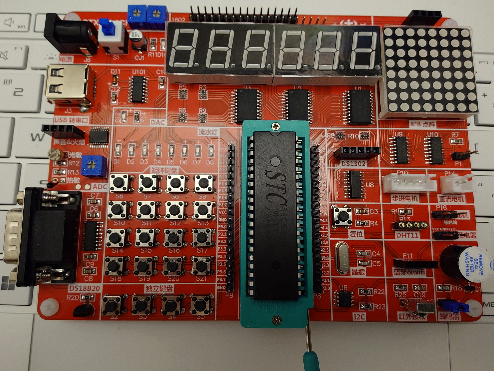

#### Disclaimer: 
This code DOES NOT represent the best practices in embedded programming, and it may NOT be well-commented; it is NOT intended for production use (no maintenance or support).

## Table of Contents
- [Brief](#brief)
- [Power and MCU](#power-and-mcu)
- [Digital Tube/ Segment display](#digital-tube-segment-display)
- [Matrix Led](#matrix-led)
- [UART](#uart)
- [Keys](#keys)
- [PWM and Motors](#pwm-and-motors)
- [Temperature Sensor](#temperature-sensor)
- [FLASH / EEPROM (IAP/ISP)](#flash--eeprom-iapisp)
- [I2C](#i2c)

## Power and MCU
The board is can be powered by 5V DC, either from USB or external power supply. 

The MCU is STC89C52RC, which is an 8051-based microcontroller with 4KB of flash memory and 128 bytes of RAM, also powered by 5V DC.

MCU, 40 pins, with a 11.0592 MHz crystal oscillator for clock source:
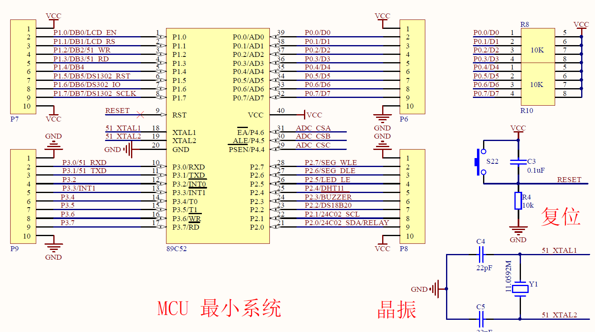

Power:

## Digital Tube/ Segment display
This board has 2 pieces of digital tube allows displaying 3 digits each, 6 in total, common cathode type.

2 latch chips (74HC573) are used to save IO pins, one for segment selection, another one for tube/number selection.
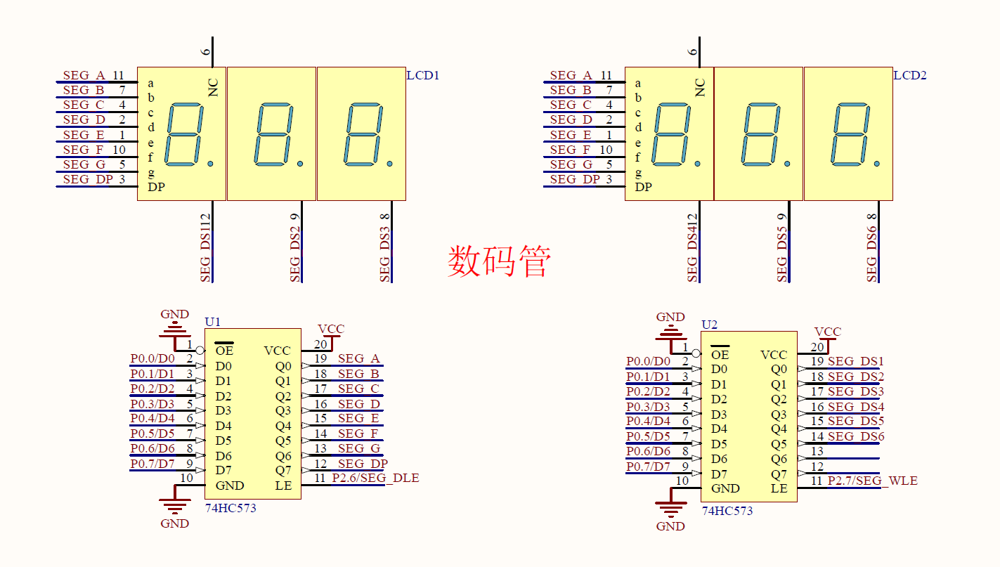

The code for controlling the digital tube (`DRIVER/DigitalTube.h`) supports an integer input with a maximum of 16 bits, in addition to floating point numbers but uses a fixed point representation with 2 decimal places since the chip does not support floating point operations. 

## Matrix Led
The board has a 8x8 matrix LED display, driven by 2 74HC595 latch chips serially for row and column selection, row -> column. The code for controlling the matrix LED supports displaying a 8x8 bitmap, which can be used to display characters or simple graphics. `DRIVER/MatrixLED.h`. Also see example of displaying a rolling number in `__EXAMPLES__\matrix_led_with_74hc595`.

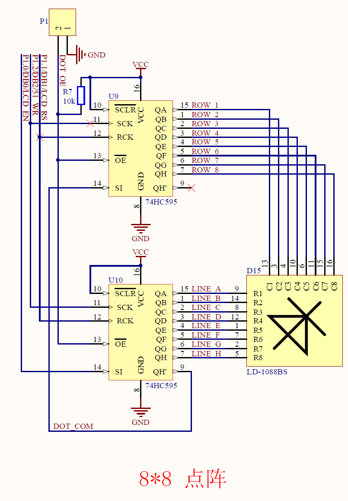

## UART
The MCU also has a UART interface for serial communication, which can be used for debugging or data transmission. The board has a USB to UART converter (CH340) and a RS232 level shifter (MAX3232) for serial communication (RS232 code is not implemented).

The code for UART communication is located in `DRIVER/UART.h`.

USB to UART converter:
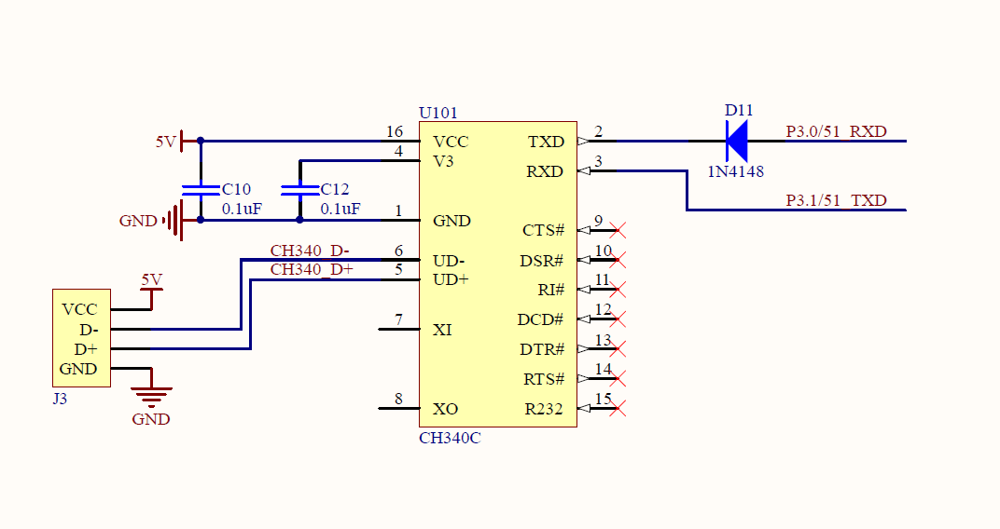

RS232 level shifter:
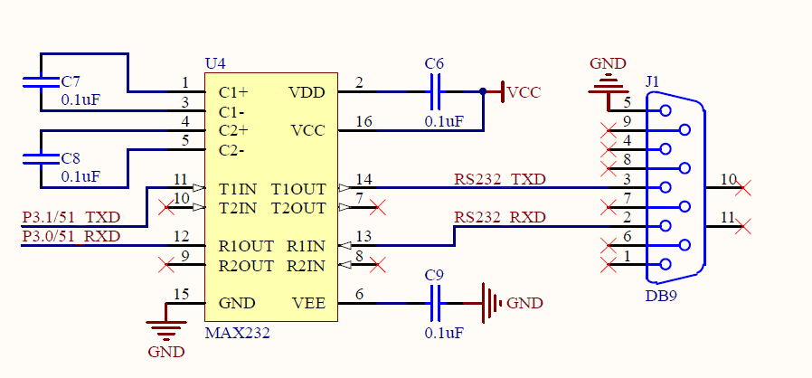

## Keys
The board has 4 standalone buttons, and a 4x4 matrix keypad, The code for controlling the keys is located in `DRIVER/Keys.h`. The key scanning is implemented is trivial, using busying waiting, which is not efficient, For a betetr implementation, an interrupt-based approach can be found in my STC8H learning project.

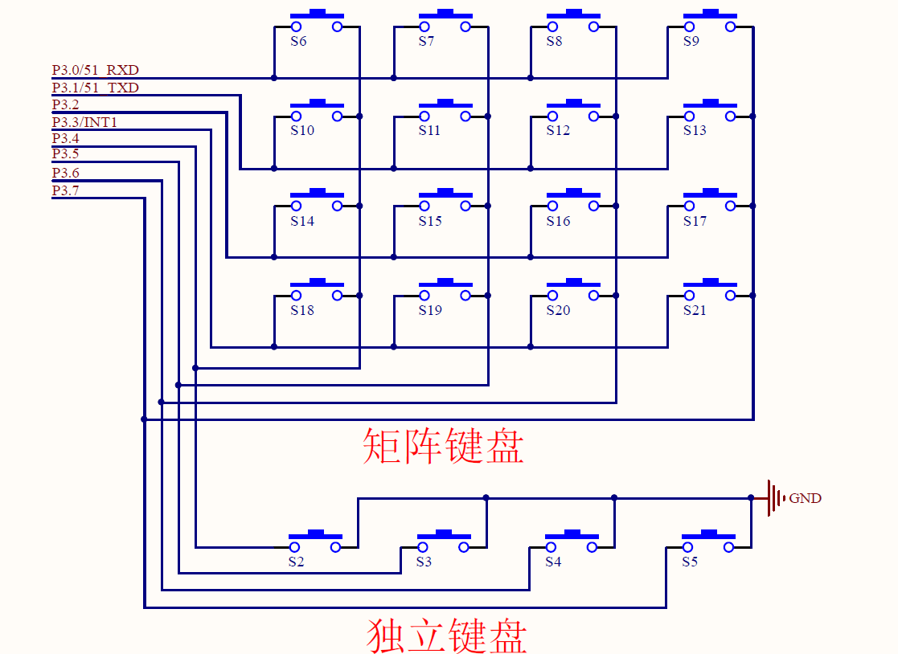

## PWM and Motors
This chip does not have a dedicated PWM module, but we can use the timer interrupt to implement a software PWM simulation. 

The code for controlling the Motors with using PWM is located in `DRIVER/DC_Motor.h`, `DRIVER/Step_Motor.h`, and `DRIVER/Servo.h`. The PWM frequency is determined by the timer interrupt frequency. All the exmalples contains button control of the speed / angle.

### DC Motor and Step Motor:
These two motors are driven by darlington transistor array (ULN2003)

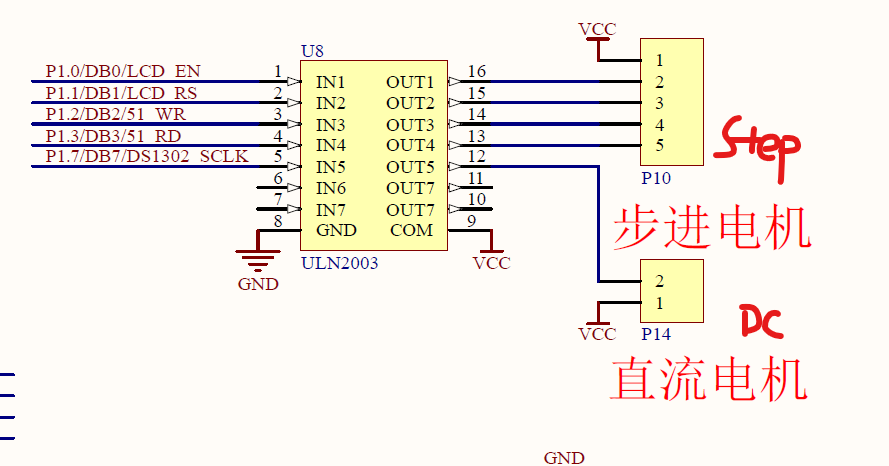

#### *DC Motor*:
DC motor is not PWM controlled, but a breathing effect is implemented by software PWM for the learning purpose.

The code is located in `__EXAMPLES__\dc_motor_breathing_pwm`.

#### *Step Motor*:
5 CABLES UNIPOLAR STEP MOTOR, 4 control wires, and 1 common wire. The code is located in `__EXAMPLES__\step_motor`.

### Servo Motor:
The real thing to control a servo motor is to generate a PWM signal with a specific duty cycle, which is determined by the desired angle of the servo. The code is located in `__EXAMPLES__\servo_motor` and `DRIVER/Servo.h`. The PWM signal is generated by using the timer interrupt, and the duty cycle is adjusted by changing the timer reload value. Example is a SG90 micro servo, which has a control signal with a pulse width of 0.5ms to 2.5ms in a 20ms period, corresponding to 0 to 180 degrees of rotation.

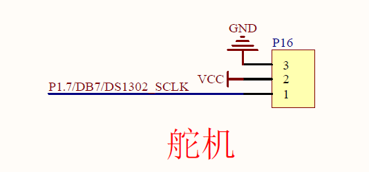

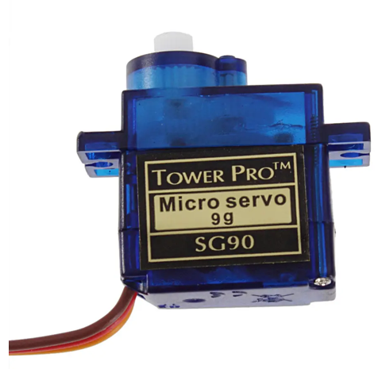

## Temperature Sensor
The board has a DS18B20 temperature sensor, which is a digital temperature sensor that uses the 1-Wire communication protocol (supporting data and power simultaneously). The board only use the data line for data, and the power is supplied by the 5V DC.

The code for controlling the DS18B20 is located in `DRIVER/DS18B20.h`. also see the example of reading and storing to EEPROM `__EXAMPLES__\ds18b20_temperature_with_eeprom`.

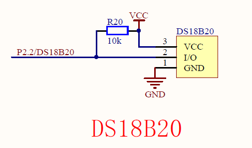

## FLASH / EEPROM (IAP/ISP)
The board doe not have a external eeprom. However, the MCU has a internal flash memory that can be used for data storage, and it uses IAP (In-Application Programming) to read and write data to the flash memory to simulate an EEPROM (erase before write).
The code for controlling the IAP is located in `DRIVER/EEPROM.h`.

The example of using IAP to store data is located in `__EXAMPLES__\ds18b20_temperature_with_eeprom`, which reads the temperature from the DS18B20 sensor and stores it in the flash memory, and then read it back and display it on the digital tube.

## I2C
The MCU does not have a dedicated I2C module, so a software simulated I2C protocol is used. The code for controlling the I2C is located in `DRIVER/i2c.h` which is adapted from HAL library. 

The example of using I2C to read data from a sensor is located in `__EXAMPLES__\traffic_light`, which reads data from a BMP280 pressure and temperature sensor and displays it on the digital tube. 

For more detail of this project, please refer to [`TrafficLight`](__EXAMPLES__/traffic_light/description.md).